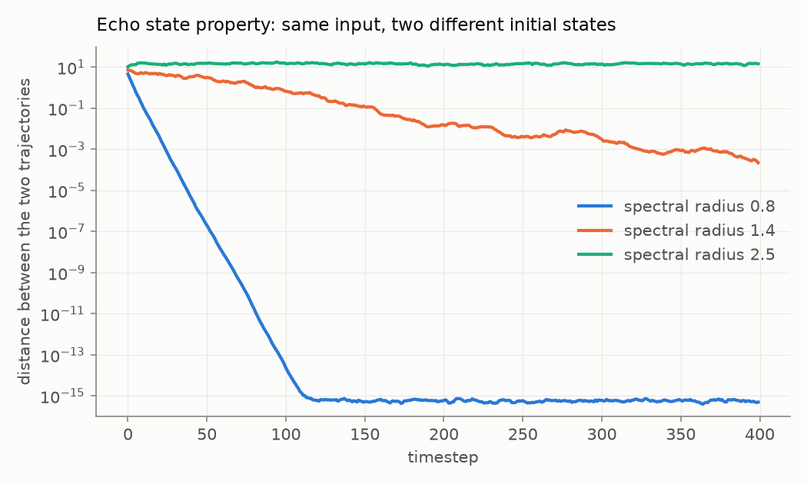
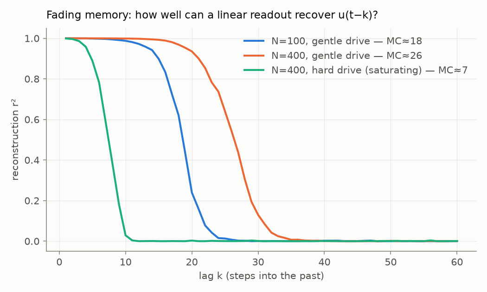
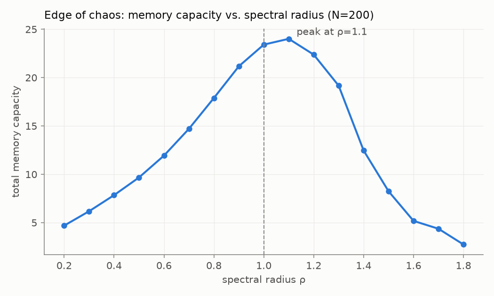
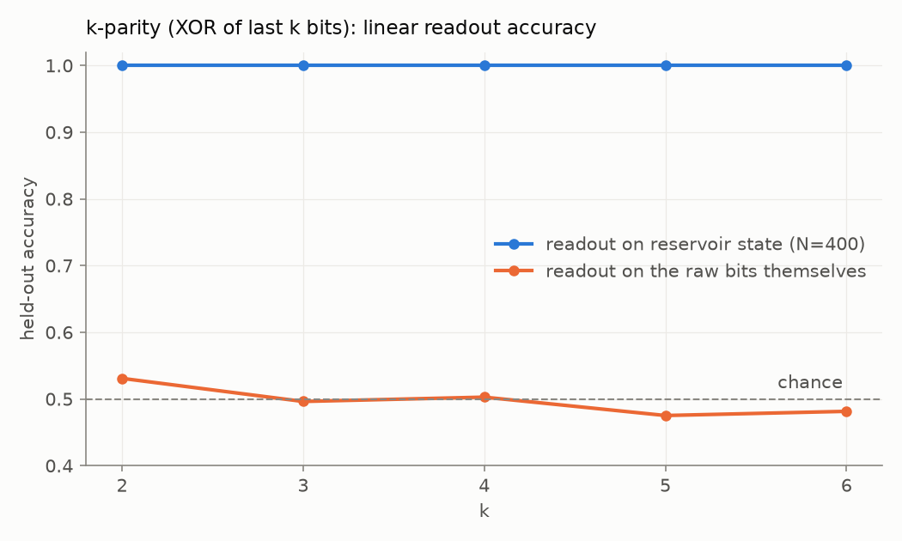

# Lesson 01 — What an echo state network actually is

*Four tiny experiments, each a few seconds of compute. Regenerate the
figures (or tweak the constants marked `TRY` and see what changes) with
`.venv/bin/python notes/lessons/01_esn_basics.py`.*

The one-sentence version: an **echo state network (ESN)** is a big random
recurrent network that is **never trained**. Input flows in, the state
`x(t)` sloshes around under fixed random weights, and the only thing we
ever fit is a **linear readout** on top of the state — one ridge
regression, closed form, no backprop, no gradients. The four demos below
show why that absurd-sounding recipe works, and where its limits are.

The update rule (from `src/rcllm/esn.py`), for reference:

```
x(t) = (1 − a) · x(t−1) + a · tanh( W x(t−1) + Win u(t) + b )
```

`W` is the fixed random recurrent matrix, `Win` the fixed random input
weights, `a` is the **leak rate** (how fast the state moves). The one
knob that matters most: `W` is rescaled so its largest eigenvalue — the
**spectral radius ρ** — has a chosen value.

---

## 1. The "echo" — why initial conditions don't matter

Run the *same network* on the *same input* from two wildly different
initial states, and watch the distance between the two trajectories:



- **ρ = 0.8 (blue):** the trajectories converge exponentially and hit
  float64 machine precision (~10⁻¹⁶) by step ~120. After that, the state
  is purely a function of the *input history* — the network "echoes" its
  input. This is the **echo state property**, and it's what makes the
  whole scheme legal: the state is a deterministic feature vector of the
  recent past, so a readout trained on it generalizes.
- **ρ = 1.4 (orange):** still converging, but ~10 orders of magnitude
  slower. The echo state property survives a bit past ρ=1 when input
  drives the network into tanh's flat (contracting) regions.
- **ρ = 2.5 (aqua):** never converges — the dynamics are chaotic, and the
  state forever depends on where it started. No echo, no reservoir.

**This is also why `washout` exists** in every run script: we throw away
the first ~100–200 steps precisely because that's how long the arbitrary
initial state takes to be forgotten. Washout length ≈ convergence time on
this plot.

## 2. Fading memory, measured

Drive the reservoir with white noise `u(t)`, then train one linear
readout per lag `k` to reconstruct `u(t−k)` from the state at time `t`.
The r² per lag is the network's *memory curve*; its sum is Jaeger's
**memory capacity** (MC), which provably can't exceed N:



- Memory is near-perfect out to some horizon, then falls off a cliff.
  Bigger reservoir (N=100 → N=400, blue → orange), longer horizon:
  MC ≈ 18 → 26.
- The aqua curve is the interesting one: same N=400, but with the input
  amplified 15× (`input_scale = 3.0`). The tanh units *saturate*, and
  memory collapses to MC ≈ 7. **Nonlinearity and linear memory compete.**
  A reservoir that mangles its input nonlinearly can't also preserve it
  verbatim. Keep this trade-off in mind — it reappears in demo 4, and
  we'll sweep `input_scale` on real text in experiment 02.

## 3. The edge of chaos

Sweep the spectral radius through 1.0 and measure total memory capacity
each time:



Too small and every echo dies almost instantly (state ≈ a very short
moving average). Too large and chaos scrambles the past into noise. The
sweet spot sits *just past* the nominal stability edge ρ=1 — driven,
leaky, saturating networks hold on a little longer than linear theory
says they should. This inverted-U is the famous **"computation at the
edge of chaos"** picture, here in ~20 lines of NumPy. Experiment 02's
E2-T3 sweep asks whether the same curve shows up when the task is
predicting *language* instead of recalling noise.

## 4. Nonlinear computation for free

**k-parity**: given a random bit stream, output the XOR of the last k
bits. This task is *provably impossible* for any linear readout on the
raw bits — parity is uncorrelated with every bit and every weighted sum
of them. Chance is the ceiling. Now give the same linear readout the
reservoir state instead:



100% accuracy through k=6, while the raw-bit readout sits at coin-flip.
Nothing was trained except a linear map — the fixed random recurrent
tanh dynamics *already computed* the nonlinear interaction features, and
the readout just picks them out. This is the reservoir bargain in one
plot: **you pay for nonlinear feature-building with a fixed dynamical
system instead of with gradient descent.**

---

## Where this leads

- **Experiment 02** (next): replace the toy bit stream with 5M characters
  of Wikipedia (text8), N=5,000, and ask how much *language* a linear
  readout can extract from a random dynamical system. The metric is
  bits-per-character; uniform guessing = 4.75, a small trained
  transformer ≈ 1.4–1.6.
- **Experiment 01**: run these exact diagnostics (memory curves, parity)
  on the hidden states of a *frozen LLM* — is a transformer's residual
  stream just a very fancy reservoir, or does attention give it a
  qualitatively different (non-fading, content-addressable) kind of
  memory?

*Things worth trying in the script: leak rate < 1 in demo 2 (stretches
memory for slow signals); different seeds (how much does MC vary?);
`fanin` (reservoir sparsity) in any demo.*
